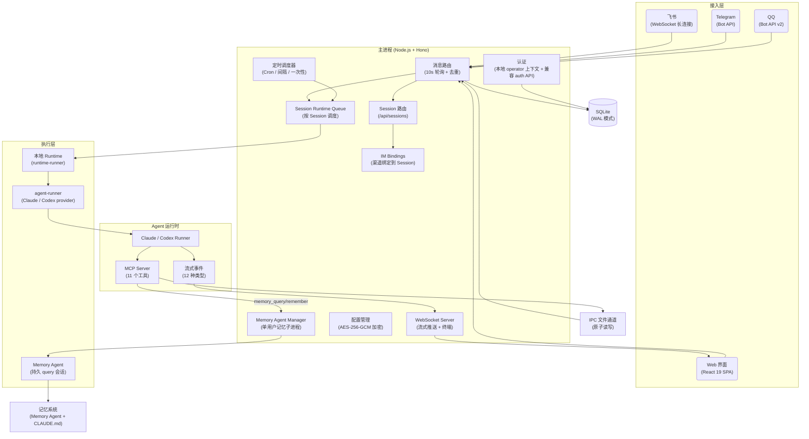

<p align="center">
  
</p>

<h1 align="center">HappyClaw (Fork)</h1>

<p align="center">
  实验性 fork — 探索更好的记忆能力和 Agent 自主性
</p>

<p align="center">
  <a href="LICENSE"></a>
  <a href="https://nodejs.org"></a>
  
  <a href="https://github.com/riba2534/happyclaw"></a>
</p>

<p align="center">
  <a href="#happyclaw-是什么">介绍</a> · <a href="#核心能力">核心能力</a> · <a href="#快速开始">快速开始</a> · <a href="#技术架构">技术架构</a> · <a href="#贡献">贡献</a>
</p>

---

| 聊天界面 — 工具调用追踪 | 聊天界面 — Markdown 渲染 | 聊天界面 — 图片生成 + 文件管理 |
|:--------------------:|:-------------------:|:----------------------:|
|  |  |  |

<details>
<summary>📸 更多截图</summary>
<br/>

**设置向导**

| 创建管理员 | 配置接入（飞书 + Claude） |
|:--------:|:---------------------:|
|  |  |

**移动端 PWA**

| 登录 | 工作区 | 系统监控 | 设置 |
|:---:|:-----:|:------:|:---:|
|  |  |  |  |

**飞书集成**

| Bot 聊天 | 富文本卡片回复 |
|:-------:|:----------:|
|  |  |

</details>

## 这个 Fork 是什么

本项目是 [HappyClaw](https://github.com/riba2534/happyclaw) 的实验性 fork，源自上游的自托管 AI Agent 系统，重点探索三个方向：

1. **Memory Agent 系统** — 独立的记忆会话与记忆子进程，自动归档对话、构建索引、深度整理，替代上游的 inline MCP 记忆工具
2. **显式消息路由** — Agent 的 stdout 仅显示在 Web 端，IM 消息必须通过 `send_message` MCP 工具显式发送，Agent 自主控制消息路由
3. **Skills 自主创建** — 移除注册表安装机制，Agent 通过 `skill-creator` 直接在文件系统中创建和管理 Skills

上游会定期选择性合并。上游的完整功能介绍请参考 [原项目 README](https://github.com/riba2534/happyclaw)。

> 当前主线已经切换到单用户多 Session workbench。
> 运行时以本地统一 runtime 和 Session 语义为主，旧 `group`、多用户、Docker 双执行模式只保留少量兼容痕迹。
> 如果 README 下面某些章节和当前行为不一致，以 `docs/single-user-session-runner-migration-plan.md` 与实际代码为准。

### 关键特性

- **单用户多 Session** — 当前主模型是一个本地操作者配合多个 Session，会话可独立选择 runner、工作目录、压缩策略和 IM 绑定
- **统一本地 Runtime** — Session 统一走本地 runtime，旧的 `host` 和 `container` 双执行模式只保留兼容痕迹，不再是产品能力
- **原生 Claude 与 Codex Runner** — 通过 runner registry 暴露 Claude 与 Codex，两者都能承接聊天主链路，兼容能力差异会在界面中明确展示
- **移动端 PWA** — 针对移动端深度优化，支持一键安装到桌面，iOS / Android 均已适配，随时随地通过手机访问 AI Agent
- **四端消息统一路由** — 飞书 WebSocket 长连接（富文本卡片、Reaction 反馈）、Telegram Bot API、QQ Bot API v2（私聊 + 群聊 @Bot）、Web 界面，四端消息统一路由

> 当前实现更接近本地 Agent workbench，而不是多租户平台。Session 是核心对象；渠道元数据落在 `session_channels`，IM 路由统一落在 `session_bindings`，新代码应优先围绕 `/api/sessions`、runner registry 和本地 runtime 理解系统。

## 核心能力

### 多渠道接入

| 渠道 | 连接方式 | 消息格式 | 特色 |
|------|---------|---------|------|
| **飞书** | WebSocket 长连接 | 富文本卡片 | 图片消息、文件消息自动下载到当前 Session 工作区、Reaction 反馈、自动注册 IM 绑定 |
| **Telegram** | Bot API (Long Polling) | Markdown → HTML | 长消息自动分片（3800 字符）、图片走 Vision（base64）、文档文件自动下载到工作区 |
| **QQ** | WebSocket (Bot API v2) | 纯文本 | 私聊 + 群聊 @Bot、图片消息（Vision）、配对码绑定 |
| **Web** | WebSocket 实时通信 | 流式 Markdown | 图片粘贴/拖拽上传、虚拟滚动 |

当前部署模型默认只有一个本地操作者。IM 渠道配置属于这一个操作者，渠道最终绑定到 Session，而不是绑定到旧多用户时代的 home group。

**Fork 特有的显式路由模型**：Agent 的 stdout（流式输出）仅显示在 Web 端。IM 用户看不到思考过程和工具调用——Agent 通过 `send_message(channel=...)` MCP 工具主动向 IM 发送最终结果，`channel` 值取自消息的 `source` 属性。


### Agent 执行引擎

主运行链路由 `src/runtime-runner.ts` 驱动，本地启动 `container/agent-runner` 中的 Claude 或 Codex provider，并统一向外暴露 Session 语义。

- **Session 是一等对象** — 主会话、workspace、worker、memory 都经由 `/api/sessions` 投影和管理
- **统一本地 runtime** — 新 Session 固定走本地 runtime；`runtime_mode`、`execution_mode` 和 `llm_provider` 旧字段都已退出对外 Session 契约
- **Runner 可切换** — 当前支持 Claude 与 Codex，runner profile、模型、thinking effort、环境变量都能在 Session 级别配置
- **多 Session 并发** — Runtime 队列按 Session 调度，并通过 `/api/status` 统一暴露运行与排队状态
- **工作目录可初始化** — 新建 Session 可从本地目录复制或从 Git 仓库初始化，再在设置中单独调整 cwd
- **失败自动恢复** — 保留指数退避重试、上下文压缩和历史归档能力


### 实时流式体验

Agent 的思考和执行过程实时推送到前端，而非等待最终结果：

- **思考过程** — 可折叠的 Extended Thinking 面板，逐字推送
- **工具调用追踪** — 工具名称、执行耗时、嵌套层级、输入参数摘要
- **调用轨迹时间线** — 最近 30 条工具调用记录，快速回溯
- **Hook 执行状态** — PreToolUse / PostToolUse Hook 的启动、进度、结果
- **流式 Markdown 渲染** — GFM 表格、代码高亮、图片 Lightbox


### 11 个 MCP 工具

Agent 在运行时可通过内置 MCP Server 与主进程通信：

| 工具 | 说明 |
|------|------|
| `send_message` | 发送文本消息，可指定 `channel` 路由到 IM（省略则仅 Web 显示） |
| `send_image` | 发送图片到 IM 渠道（10MB 限制） |
| `send_file` | 发送文件到 IM 渠道（30MB 限制） |
| `schedule_task` | 创建定时/周期/一次性任务（cron / interval / once） |
| `list_tasks` | 列出定时任务 |
| `pause_task` / `resume_task` / `cancel_task` | 暂停、恢复、取消任务 |
| `register_group` | 创建新工作区 Session 的兼容入口 |
| `memory_query` | 查询 Memory Agent 记忆（同步，返回结果） |
| `memory_remember` | 存储信息到 Memory Agent（异步） |

### 定时任务

- 三种调度模式：**Cron 表达式** / **固定间隔** / **一次性执行**
- 两种上下文模式：`group` 表示在指定 Session 中执行，`isolated` 表示独立隔离环境
- 完整的执行日志（耗时、状态、结果），Web 界面管理


### 记忆系统（Fork 特有：Memory Agent）

独立的 Memory Agent 子进程管理持久记忆，替代上游的 inline MCP 工具：

- **Memory Session** — 记忆能力以 `memory:{ownerKey}` Session 暴露，可单独选择 runner，目前本地已验证 Claude 与 Codex 都能承接
- **Memory Agent** — 记忆子进程负责归档对话、生成印象、维护知识索引
- **随身索引** — `data/memory/{ownerKey}/index.md`，主 Agent 每次对话自动加载，Memory Agent 查询后自修复索引
- **自动会话归档** — Session runtime 收尾时自动导出对话转录到 `transcripts/`，触发 `session_wrapup` 生成印象和知识
- **深度整理** — `global_sleep` 定期压缩索引、清理旧印象、更新用户画像（需距上次 >6h、无活跃会话、有待处理 wrapup）
- **会话记忆** — `data/groups/{folder}/CLAUDE.md`，会话私有（与上游相同）
- **Web 管理** — Memory Agent 状态面板、手动触发按钮、超时配置、记忆文件在线编辑


### Skills 系统（Fork 特有：Agent 自主创建）

- **项目级 Skills** — 放在 `container/skills/`，作为本地 runtime 的共享技能目录
- **本地技能目录** — Agent 可通过 `skill-creator` 直接写入本地技能目录，当前存储结构仍带有兼容期的 ownerKey 维度
- **主机同步** — 可将宿主机 `~/.claude/skills/` 同步到本地技能目录
- 无需镜像构建，符号链接与本地目录扫描即可自动发现技能。上游的注册表安装机制已移除

### Web 终端

基于 xterm.js + node-pty 的完整终端：WebSocket 连接，可拖拽调整面板，直接在 Web 界面中操作服务器。


### 移动端 PWA

专为移动端优化的 Progressive Web App，手机浏览器一键安装到桌面：

- **原生体验** — 全屏模式运行，独立的应用图标，视觉上与原生 App 无异
- **响应式布局** — 移动端优先设计，聊天界面、设置页面、监控面板均适配小屏幕
- **iOS / Android 适配** — 安全区域适配、滚动优化、字体渲染、触摸交互
- **随时可用** — 任何时间、任何地点，掏出手机就能与 AI Agent 对话、查看执行状态、管理任务


### 文件管理

上传（50MB 限制）/ 下载 / 删除，目录管理，图片预览，拖拽上传。路径遍历防护 + 系统路径保护。

### 安全与运行控制

| 能力 | 说明 |
|------|------|
| **单用户默认模型** | 当前默认只有一个本地操作者，权限、邀请码、计费等旧多用户能力已退出主链路 |
| **Session 级边界** | cwd、runner、压缩策略、环境变量和 IM 绑定都以 Session 为边界管理 |
| **个性化设置** | 可自定义 AI 名称、头像 emoji 和颜色 |
| **本地 operator 上下文** | Web API 直接注入固定本地 operator，`/api/auth/*` 只保留兼容接口，不再依赖首装建号、邀请码或应用层密码登录 |
| **加密存储** | API 密钥 AES-256-GCM 加密，Web API 仅返回掩码值 |
| **挂载安全** | 白名单校验 + 黑名单模式匹配（`.ssh`、`.gnupg` 等敏感路径） |
| **终端权限** | 可直接从 Web 打开当前 Session 终端 |
| **PWA** | 一键安装到手机桌面，移动端深度优化，随时随地使用 AI Agent |

## 快速开始

### 前置要求

开始之前，请确保以下依赖已安装：

**必需**

- **[Node.js](https://nodejs.org) >= 20** — 运行主服务和前端构建
  - macOS: `brew install node`
  - Linux: 参考 [NodeSource](https://github.com/nodesource/distributions) 或使用 `nvm`
  - Windows: [官网下载](https://nodejs.org)

- **至少一个可用 Runner**
  - Claude 路线：本机可用 Claude Code CLI，并完成本地登录或兼容配置
  - Codex 路线：本机具备 Codex 所需认证，或在 Web 中配置兼容的 Base URL / 默认模型
  - 两个 runner 不必同时启用，但至少需要一个能跑通

**可选**

- 飞书企业自建应用凭据 — 仅飞书集成需要，前往 [飞书开放平台](https://open.feishu.cn) 创建
- Telegram Bot Token — 仅 Telegram 集成需要，通过 [@BotFather](https://t.me/BotFather) 获取
- QQ Bot 凭据 — 仅 QQ 集成需要，前往 [QQ 开放平台](https://q.qq.com/qqbot/openclaw/index.html) 创建

> 当前主线不再要求 Docker。HappyClaw 会在本地 runtime 中启动 Claude 或 Codex runner，并沿用兼容层保存少量旧字段。

### 安装启动

```bash
# 1. 克隆仓库（Fork）
git clone https://github.com/ar8327/happyclaw.git
cd happyclaw

# 2. 一键启动（首次自动安装依赖 + 编译）
make start

访问： http://localhost:3000

如需公网访问，可以自行使用 nginx/caddy 配置反向代理
```

按照设置向导完成初始化：

1. **创建管理员** — 自定义用户名和密码（无默认账号）
2. **配置 Runner** — 按需完成 Claude 或 Codex 配置，至少保证一个 runner 可用
3. **配置 IM 通道**（可选）— 飞书 App ID/Secret、Telegram Bot Token 或 QQ Bot 凭据
4. **开始对话** — 在 Web 聊天页面直接发送消息

> 所有配置通过 Web 界面完成，不依赖任何配置文件。API 密钥 AES-256-GCM 加密存储。

### 配置飞书集成

1. 前往 [飞书开放平台](https://open.feishu.cn)，创建企业自建应用
2. 在应用的「事件订阅」中添加：`im.message.receive_v1`（接收消息）
3. 在应用的「权限管理」中开通以下权限：
   - `im:message`（发送消息）
   - `im:message.group_at_msg:readonly`（接收群聊 @消息）
   - `im:message.group_msg`（接收群聊所有消息）— **敏感权限**，需管理员审批。如不开通，群聊中只有 @机器人 的消息才会被处理
   - `im:message.p2p_msg:readonly`（接收私聊消息）
4. 发布应用版本并等待审批通过
5. 在 HappyClaw Web 界面的「设置 → IM 通道 → 飞书」中填入 App ID 和 App Secret

当前配置入口仍位于个人设置页，但在单用户部署里它实际对应这一个本地操作者的飞书 Bot。

> **群聊 Mention 控制**：新接入的群聊默认继承 `activation_mode=auto` 与 `require_mention=false`，也就是在具备 `im:message.group_msg` 权限时会处理群内普通消息。可通过 `/require_mention true` 切换为仅响应 @机器人。


### 配置 Telegram 集成

1. 在 Telegram 中搜索 [@BotFather](https://t.me/BotFather)，发送 `/newbot` 创建 Bot
2. 记录返回的 Bot Token
3. 在 HappyClaw Web 界面的「设置 → IM 通道 → Telegram」中填入 Bot Token
4. **群聊使用**：如需在 Telegram 群中使用 Bot，需在 BotFather 中发送 `/mybots` → 选择 Bot → Bot Settings → Group Privacy → Turn off，否则 Bot 只能接收 `/` 命令消息


### 配置 QQ 集成

1. 前往 [QQ 开放平台](https://q.qq.com/qqbot/openclaw/index.html)，使用手机 QQ 扫码注册登录
2. 创建机器人，设置名称和头像
3. 在机器人管理页面获取 **App ID** 和 **App Secret**
4. 在 HappyClaw Web 界面的「设置 → IM 通道 → QQ」中填入 App ID 和 App Secret
5. **配对绑定**：在设置页生成配对码，然后在 QQ 中向 Bot 发送 `/pair <配对码>` 完成绑定

> QQ Bot 使用官方 API v2 协议，支持 C2C 私聊和群聊 @Bot 消息。群聊中 Bot 仅接收 @Bot 的消息。

### IM 斜杠命令

飞书/Telegram/QQ 中以 `/` 开头的消息会被拦截为斜杠命令（未知命令继续作为普通消息处理）：

| 命令 | 缩写 | 用途 |
|------|------|------|
| `/list` | `/ls` | 查看所有工作区和对话列表 |
| `/status` | - | 查看当前工作区/对话状态 |
| `/where` | - | 查看当前绑定位置和回复策略 |
| `/bind <target>` | - | 绑定到指定工作区或 Agent（如 `/bind myws` 或 `/bind myws/a3b`） |
| `/unbind` | - | 解绑回默认工作区 |
| `/new <名称>` | - | 创建新工作区并绑定当前群组 |
| `/recall` | `/rc` | AI 总结最近对话记录 |
| `/clear` | - | 清除当前对话的会话上下文 |
| `/require_mention` | - | 切换群聊响应模式：`true`（需要 @）或 `false`（全量响应） |


### Runner 选择

| Runner | 说明 | 当前状态 |
|------|------|---------|
| **Claude** | 原生支持更完整的 session resume、hook 与 observability | 聊天、记忆、IM、观测均为 full |
| **Codex** | 聊天主链路可用，但记忆和观测存在降级 | 聊天可用，memory 与 observability 为 degraded 或 synthetic |

当前所有 Session 都通过本地 runtime 启动。`runtime_mode`、`execution_mode` 与 `llm_provider` 已不再作为 Session 接口字段返回；如果请求体继续携带这些旧字段，`/api/sessions` 会直接拒绝。它们只在历史数据库迁移和启动期兼容清理中被识别并移除。

## 技术架构

### 架构图



**数据流**：消息从接入层进入主进程，经去重和 Session 路由后分发到并发队列。队列统一启动本地 runtime，由 `runtime-runner` 调度 `container/agent-runner` 中的 Claude 或 Codex provider。流式事件通过 stdout 标记协议传回主进程，经 WebSocket 广播到 Web 客户端。IM 消息由 Agent 通过 `send_message` MCP 工具显式发送，经 IPC 文件通道路由到对应 IM 渠道。Memory Agent 作为独立子进程运行，Agent 通过 `memory_query` 和 `memory_remember` MCP 工具与之通信。

### 技术栈

| 层次 | 技术 |
|------|------|
| **后端** | Node.js 22 · TypeScript 5.7 · Hono · better-sqlite3 (WAL) · ws · node-pty · Pino · Zod |
| **前端** | React 19 · Vite 6 · Zustand 5 · Tailwind CSS 4 · shadcn/ui · Radix UI · Lucide Icons · react-markdown · mermaid · xterm.js · @tanstack/react-virtual · PWA |
| **Runtime** | `src/runtime-runner.ts` · `container/agent-runner` · Claude Code CLI · Codex SDK · MCP SDK · IPC 文件通道 |
| **记忆** | `container/memory-agent` · transcript wrapup · `CLAUDE.md` · Memory 索引 |
| **安全** | 本地 operator 上下文 · AES-256-GCM · 路径遍历防护 · 挂载白名单 |
| **IM 集成** | @larksuiteoapi/node-sdk (飞书) · grammY (Telegram) · QQ Bot API v2 (WebSocket + REST) |

### 目录结构

所有运行时数据统一在 `data/` 目录下，启动时自动创建，无需手动初始化。

```
happyclaw/
├── src/                          # 后端源码
│   ├── index.ts                  #   入口：消息轮询、IPC 监听、Session 编排
│   ├── web.ts                    #   Hono 应用、WebSocket、静态文件
│   ├── routes/                   #   路由（sessions / auth / files / config / monitor / memory / tasks / agents / mcp-servers）
│   ├── feishu.ts                 #   飞书连接工厂（WebSocket 长连接）
│   ├── telegram.ts               #   Telegram 连接工厂（Bot API）
│   ├── qq.ts                     #   QQ 连接工厂（Bot API v2 WebSocket）
│   ├── im-manager.ts             #   IM 连接池与渠道投递
│   ├── im-downloader.ts          #   IM 文件下载工具（保存到工作区 downloads/）
│   ├── runtime-runner.ts         #   统一本地 runtime 启动器
│   ├── session-runtime-manager.ts#   Session runtime 状态管理
│   ├── session-runtime-queue.ts  #   Session runtime 并发调度
│   ├── runtime-config.ts         #   AES-256-GCM 加密配置
│   ├── task-scheduler.ts         #   定时任务调度
│   ├── file-manager.ts           #   文件安全（路径遍历防护）
│   ├── mount-security.ts         #   挂载白名单 / 黑名单
│   └── db.ts                     #   SQLite 数据层与 Session 投影
│
├── web/                          # 前端 (React + Vite)
│   └── src/
│       ├── pages/                #   Chat / Settings / Monitor 等页面
│       ├── components/           #   UI 组件（shadcn/ui）
│       ├── stores/               #   Session、监控与设置 Zustand Store
│       └── api/client.ts         #   统一 API 客户端
│
├── container/                    # Runtime worker 代码与共享技能
│   ├── agent-runner/             #   本地 runtime 复用的执行引擎
│   │   └── src/
│   │       ├── index.ts          #     Agent 主循环 + 流式事件
│   │       ├── happyclaw-mcp-server.ts # 共用 MCP server 入口
│   │       └── providers/        #     Claude / Codex provider 实现
│   ├── memory-agent/             #   Memory Agent 子进程（Fork 特有）
│   │   └── src/index.ts          #     持久 query 会话 + JSON-line 通信
│   └── skills/                   #   项目级 Skills
│
├── shared/                       # 跨项目共享类型定义
│   └── stream-event.ts           #   StreamEvent 类型单一真相源
│
├── scripts/                      # 构建辅助脚本
│   ├── sync-stream-event.sh      #   同步 shared/ 类型到各子项目
│   └── check-stream-event-sync.sh#   校验类型副本一致性
│
├── config/                       # 项目配置
│   ├── default-groups.json       #   预注册 Session 兼容记录
│   └── mount-allowlist.json      #   本地 runtime 路径白名单
│
├── data/                         # 运行时数据（启动时自动创建）
│   ├── db/messages.db            #   SQLite 数据库（WAL 模式）
│   ├── groups/{folder}/          #   会话工作目录（Agent 可读写）
│   │   ├── downloads/{channel}/  #     IM 文件下载（feishu/telegram/qq，按日期分子目录）
│   │   └── CLAUDE.md             #     会话私有记忆
│   ├── sessions/{folder}/.claude/#   Claude 会话持久化
│   ├── ipc/{folder}/             #   IPC 通道（input / messages / tasks）
│   ├── env/{folder}/env          #   Session 环境变量文件
│   ├── memory/{ownerKey}/        #   Memory Agent 数据（index.md / impressions / knowledge / transcripts）
│   └── config/                   #   加密配置文件
│
└── Makefile                      # 常用命令
```

### 开发指南

```bash
make dev              # 前后端并行启动（热更新）
make dev-backend      # 仅启动后端
make dev-web          # 仅启动前端
make build            # 编译全部（后端 + 前端 + agent-runner）
make start            # 一键启动生产环境
make typecheck        # TypeScript 全量类型检查
make format           # 代码格式化（Prettier）
make clean            # 清理构建产物
make reset-init       # 重置为首装状态（清空数据库、配置、工作区、记忆、会话）
make backup           # 备份运行时数据到 happyclaw-backup-{date}.tar.gz
make restore          # 从备份恢复数据（make restore 或 make restore FILE=xxx.tar.gz）
```

| 服务 | 默认端口 | 说明 |
|------|---------|------|
| 后端 | 3000 | Hono + WebSocket |
| 前端开发服务器 | 5173 | Vite，代理 `/api` 和 `/ws` 到后端（仅开发模式） |

#### 自定义端口

**生产模式**（`make start`）：只有后端服务，前端作为静态文件由后端托管，通过 `WEB_PORT` 环境变量修改端口：

```bash
WEB_PORT=8080 make start
# 访问 http://localhost:8080
```

**开发模式**（`make dev`）：前端 Vite 开发服务器（`5173`）和后端（`3000`）分别运行，开发时访问 `5173`。

修改后端端口：

```bash
# 后端改为 8080（通过环境变量）
WEB_PORT=8080 make dev-backend

# 前端需同步修改代理目标，否则 API 请求会发到默认的 3000
VITE_API_PROXY_TARGET=http://127.0.0.1:8080 VITE_WS_PROXY_TARGET=ws://127.0.0.1:8080 make dev-web
```

修改前端端口：通过 Vite CLI 参数覆盖：

```bash
cd web && npx vite --port 3001
```

### 环境变量

以下为可选覆盖项。推荐优先通过 Web 设置界面维护 runner 与 IM 配置。

| 变量 | 默认值 | 说明 |
|------|--------|------|
| `WEB_PORT` | `3000` | Web 服务端口 |
| `ASSISTANT_NAME` | `HappyClaw` | 助手显示名称 |
| `RUNTIME_TIMEOUT` | `1800000`（30min） | 单个 runtime 的最长执行时间 |
| `IDLE_TIMEOUT` | `1800000`（30min） | runtime 空闲回收时长 |
| `RUNTIME_MAX_OUTPUT_SIZE` | `10485760` | 单次 runtime 输出大小上限 |
| `MAX_CONCURRENT_RUNTIMES` | `20` | 同时运行的 Session runtime 上限 |
| `TRUST_PROXY` | `false` | 信任反向代理的 `X-Forwarded-For` 头 |
| `TZ` | 系统时区 | 定时任务时区 |

兼容提示：`CONTAINER_TIMEOUT`、`CONTAINER_MAX_OUTPUT_SIZE`、`MAX_CONCURRENT_CONTAINERS` 等旧变量仍可作为回退值读取，但不建议继续扩散。

### 管理员密码恢复

```bash
npm run reset:admin -- <用户名> <新密码>
```

### 数据重置

```bash
make reset-init

# 或手动：
rm -rf data store
```

## 贡献

欢迎提交 Issue 和 Pull Request！

### 开发流程

1. Fork 仓库并克隆到本地
2. 创建功能分支：`git checkout -b feature/your-feature`
3. 开发并测试：`make dev` 启动开发环境，`make typecheck` 检查类型
4. 提交代码并推送到 Fork
5. 创建 Pull Request 到 `main` 分支

### Commit 规范

Commit message 使用简体中文，格式：`类型: 描述`

```
修复: 侧边栏下拉菜单无法点击
新增: Telegram Bot 集成
重构: 统一消息路由逻辑
```

### 项目结构

项目包含四个独立的 Node.js 项目，各有独立的 `package.json` 和 `tsconfig.json`：

| 项目 | 目录 | 用途 |
|------|------|------|
| 主服务 | `/`（根目录） | 后端服务 |
| Web 前端 | `web/` | React SPA |
| Agent Runner | `container/agent-runner/` | 本地 runtime 使用的执行引擎 |
| Memory Agent | `container/memory-agent/` | 记忆子进程 |

## 许可证

[MIT](LICENSE)
